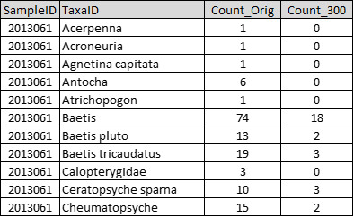

```{r setup, include=FALSE}
knitr::opts_chunk$set(echo = FALSE)
```

### Purpose

Subsample your abundance data to a fixed count per sample. For example, if 
300-organisms is your target, and any of your samples have more than 300 
organisms, you can use this function to randomly subsample your data so that the
total number of individuals is 300. This is done to make richness metrics 
comparable (since higher numbers of taxa generally occur in samples in which 
more individuals are counted). The function is based on code from USEPA 
Corvallis John Van Sickle’s R code for RIVPACS (v1.0, 2005-06-10).

### Notes

There are three required fields: SampleID, TaxaID, Count. These are defined by 
the user using the pull down lists.  Any additional columns in your file and 
will be carried through into the output file.

Any samples with a total number of organisms above the 'target' (e.g., 300) will
be subsampled to the target number.

Using a 'numeric seed' (suggested to be at least 8-digits) allows you to 
generate the same results with the same file at a later time.

After you unzip the output file, you’ll see a ‘results’ folder and then a 
'subsample' folder with two csv files (see screenshot below). It’s fine to 
delete the zipped file after you extract the files. 



The Shiny app is set up to subsample to the exact number of organisms (in our 
default example, 300). If you are skilled with R, you could download the 
BioMonTools R package (https://github.com/leppott/BioMonTools), install it, and 
adjust the upper limit on the number of organisms that trigger subsampling. As 
an example, you could set it up so that the R code only subsamples when samples 
have over 20% of the target number of total individuals (in the default example,
this would be 360 total individuals). For more information, contact Erik ([Erik.Leppo\@tetratech.com](mailto:Erik.Leppo@tetratech.com){.email}).

*Last updated 2022-01-31*
