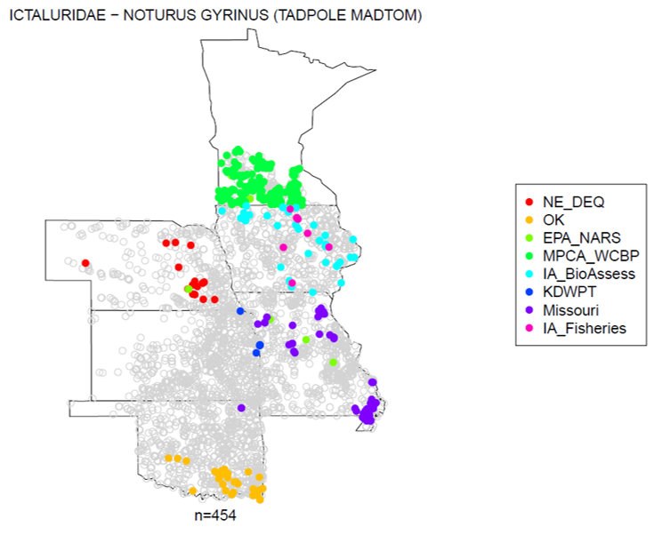

```{r setup, include=FALSE}
knitr::opts_chunk$set(echo = FALSE)
```

### Purpose

Create maps like the example shown below. 



The grouping variable is optional but is used to create the legend.

**Warning!** The output files can be very large (the PDFs treat every data point as 
an individual graphic element). Consider limiting the number of taxa in your 
input files.

WANT TO TRY RUNNING IT WITH TEST DATA?
Click below to download an example input and output file.

```{r, echo=FALSE, eval=TRUE}
shiny::a("Example test files"
         , href = file.path("linked_files"
                            , "MarkExcluded"
                            , "TaxaMaps_ExampleFiles.zip"))
```

```{r, echo=FALSE, eval=TRUE}
shiny::a("Example script"
         , href = file.path("linked_files"
                            , "MarkExcluded"
                            , "BMT_MapTaxaObs_Example1.R"))
```


If you prefer you run this function using R console instead of the Shiny app.

The R package is available for download on GitHub.  Use the green "Code" button.

 <https://github.com/leppott/BioMonTools> 

To install from within R use the code below.
```{r install, eval=FALSE, echo=TRUE}
if(!require(remotes)){install.packages("remotes")}  #install if needed
install_github("leppott/BioMonTools", force=TRUE, build_vignettes=TRUE)
```

*Last updated 2022-02-01*
