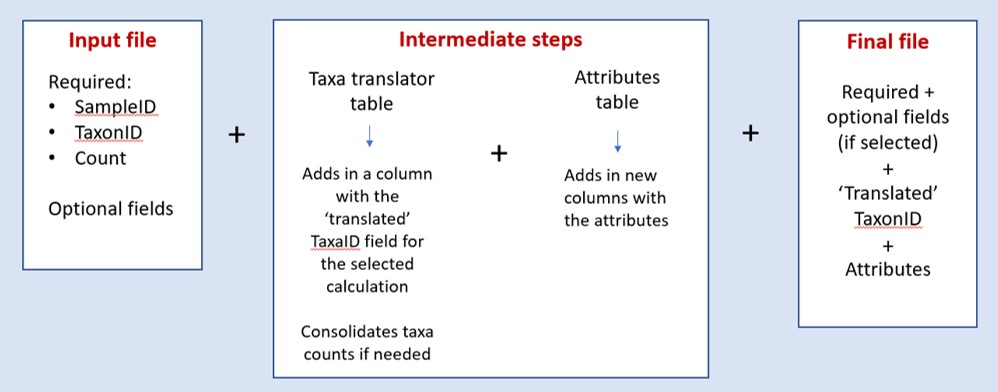

```{r setup, include=FALSE}
knitr::opts_chunk$set(echo = FALSE
                      , results = 'asis'
                      , warning = FALSE
                      , message = FALSE)
```

# Purpose
Create an input file with the proper Operational Taxonomic Units (OTUs) and 
attributes for each calculation. 

OTUs differ across calculations. For example, for one model calculation, 
worms might be collapsed to Subclass and mites to Order-level. But for another
calculation, mites and worms might be kept at the lowest practical taxonomic 
level. 

This function performs two steps to the input file:

1. "Translates" the original TaxonID to the proper OTU based on the selected 
calculation

2. Appends the correct regional taxa attributes, e.g., functional feeding group.

If you have questions or comments about these tables, or want to request the
addition of new taxa, please email Jen Stamp (Jen.Stamp@tetratech.com).

Click 
<a href="https://github.com/leppott/BioMonTools_SupportFiles/tree/main/data/taxa_official/RMN" target = "_blank">here</a> 
 to download the tables and associated metadata files from GitHub.

{width=80%}

# Input File
There are three required fields:

* SampleID

    + Unique sample identifier.  Includes any replicate/duplicate information.

* TaxaID

    + Unique taxa name

* Count of individuals (e.g., N_Taxa)

    + Count of taxa individuals
    
If you named the required fields differently in your input file, it’s ok. Click 
on the drop-down menus. The list of fields in your input file will appear. 
Select the correct column headings.

Optional - if there are additional fields in the input file that you want to 
carry through into the output file (e.g., stationID, collection date, latitude,
longitude), click on the ‘Columns to keep in output’ box. The list of fields in 
your input file will appear. Click on the fields that you want to include.  If 
you change your mind and want to remove a field, click on it and hit ‘delete.’ 

IMPORTANT: Do not repeat the required columns. Do not include Life Stage or 
other fields that are unique to the taxa and not the sample (such as notes from 
the taxonomist). If a taxon occurs in more than one row for a given sample, it 
will lead to double-counting of that taxon in the richness metrics.

# Test File

Click [here](links/TaxaTrans/Test1_FileBuilder_TaxaTransAttr.csv) to download a test file.

Note that there is one taxon (Atherix) in the input file that comes out as a 
‘nonmatch.’ This is because it has a trailing space. R is sensitive to leading 
and trailing spaces and is also case sensitive (for example, it recognizes 'A'
and 'a' as different variables).

Click [here](links/TaxaTrans/examples_all.zip) to download example R scripts and data (all
functions).

---

*Last updated 2025-02-25*
